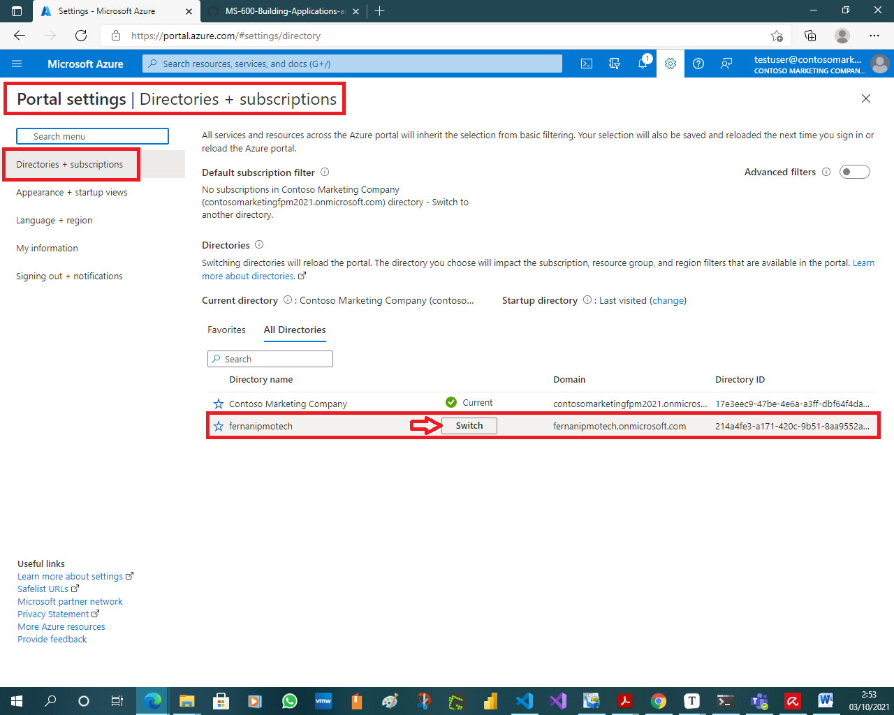

# Exercise 3: Implementing application that supports B2B

This exercise will demonstrate to the user how to configure and implement an application that supports B2B.
**Note**:
This exercise demonstrates signing into a web application using three different accounts. These three accounts will come from two organizations, one of them being the organization where the Azure AD application is registered. Therefore, in order to complete the exercise, you'll need access to two user accounts in different Azure AD directories.

## Task 1: Create a single-tenant Azure AD application

In this task, you'll create an Azure AD application that allows users from the current organization to sign in.

### Register a single-tenant Azure AD application

1. From the Azure portal [https://azure.portal.com](https://azure.portal.com/), navigate to **Azure Active Directory**.

    

1. Select **Manage > App registrations** in the left-hand navigation.

1. On the **App registrations** page, select **New registration**.

    

1. On the **Register an application** page, set the values as follows:

    - **Name**: Hello ASPNET Core Identity 03

    - **Supported account types**: Accounts in this organizational directory only (Single tenant)

1. Select **Register** to create the application.

    

1. On the **Hello ASPNET Core Identity 03** page, copy the values **Application (client) ID** and **Directory (tenant) ID**; you'll need these values later in this exercise.

    

1. On the **Hello ASPNET Core Identity 03** page, select the **Add a Redirect URI** link under the **Redirect URIs**.

    

    

1. Locate the section **Redirect URIs** and add the following two URLs:

    - **https://localhost:3007**

    - **https://localhost:3007/signin-oidc**

      

1. Add the following **Logout URL**: **https://localhost:3007/signout-oidc**

    

    

1. Locate the section **Implicit grant** and select both **Access tokens** and **ID tokens**. This tells Azure AD to return these tokens the authenticated user if requested.

1. Select **Save** when finished setting these values.

     

## Task 2: Create a single organization ASP.NET core web application

In this application, you'll create an ASP.NET Core web application that allows users from the current organization to sign in and display their information.

1. Open your command prompt, navigate to a directory where you want to save your work, create a new folder, and change directory into that folder. For example:

    ```powershell
    Cd c:/LabFiles
    md SingleOrgGuests
    cd SingleOrgGuests
    ```

    

1. Execute the following command to create a new ASP.NET Core MVC web application:

    ```powershell
    dotnet new mvc --auth SingleOrg
    ```

    

1. Open the folder in Visual Studio code by executing from the project directory: **code .**

    

### Configure the web application with the Azure AD application you created

1. Locate and open the **./appsettings.json** file in the ASP.NET Core project.

   

1. Set the **AzureAd.Domain** property to the domain of your Azure AD tenant where you created the Azure AD application (*for example: contoso.onmicrosoft.com*).

1. Set the **AzureAd.TenantId** property to the **Directory (tenant) ID** you copied when creating the Azure AD application in the previous step.

1. Set the **AzureAd.ClientId** property to the **Application (client) ID** you copied when creating the Azure AD application in the previous step.

   

### Update the web application's launch configuration

1. Locate and open the **./Properties/launchSettings.json** file in the ASP.NET Core project.

   

   

1. Set the **iisSettings.iisExpress.applicationUrl** property to **https://localhost:3007**.

1. Set the **iisSettings.iisExpress.sslPort** property to **3007**.


### Update the user experience

1. Finally, update the user experience of the web application to display all the claims in the OpenID Connect ID token.

1. Locate and open the **./Views/Home/Index.cshtml** file.

    

1. Add the following code to the end of the file:

    ```powershell
    @if (User.Identity.IsAuthenticated)
    {
    <div>
        <table cellpadding="2" cellspacing="2">
            <tr>
                <th>Claim</th>
                <th>Value</th>
            </tr>
            @foreach (var claim in User.Claims)
            {
                <tr>
                    <td>@claim.Type</td>
                    <td>@claim.Value</td>
                </tr>
            }
        </table>
    </div>
    }
    ```

    

1. Save the above all changes.

    

## Task 3: Build and test the app

1. Execute the following command in a command prompt to compile and run the application:

    ```powershell
    dotnet build
    dotnet run
    ```

    

1. Open a browser and navigate to the url **https://localhost:5001**. The web application will redirect you to the Azure AD sign in page.

    

1. Sign in using a Work and School account from your Azure AD directory. Azure AD will redirect you back to the web application. Notice some of the details from the claims included in the ID token.

    

1. Take special note of the **tenantid** and **upn** claim. These claims indicate the ID of the Azure AD directory and ID of the user that signed in. Make a note of these values to compare them to other options in a minute.

    

    

1. Now try logging in as a user from a different organization. Select the **Sign out** link in the top left. Wait for Azure AD and the web application signs out the current user. When the web application reloads, repeat the sign in process, except this time try signing in as a user from a different organization or use a Microsoft Account.

    

    

    

    

1. Notice Azure AD will reject the user's sign in, explaining that the user's account doesn't exist in the current tenant.


Before this user can access this application, they need to be added as a guest into the Azure AD directory where the application was registered. Proceed with the next task to invite a guest user to your organization.

## Task 4: Invite a guest user from another organization

In this task, you will configure your Active Directory tenant to allow external users and then will invite a guest user from another Active Directory organization.

1. From the Azure portal, navigate to **Azure Active Directory**.

1. In the left-hand navigation, select **User**.

    

1. Examine the external user settings for available to administrators by selecting **User Settings** and then **Manage external collaboration settings**.

    

    

    

1. Notice that administrators can configure the Azure AD directory so guest users have limited rights 

1. Now let's invite a guest user. Select **All users** in the left-hand navigation, and then select **New guest user**:

    

1. On the **New user** page, select Invite user and then add the guest user's information:

    - **Name:** Test User

    - **Email address:** Type the email address of the new user you created in Exercise 1 Task 3. *For example: testuser@contosomarketing001.onmicrosoft.com*

1. Select **Invite** to automatically send the invitation to the guest user.

    

    

1. Now let's try to sign in with the user. In the browser, navigate to **https://localhost:5001**.

1. This time, after successfully logging in, the user's Azure AD directory will prompt the user to grant the application's Azure AD directory permissions to sign in as the user and obtain basic information about the user.

    

1. Take note of what is happening at this point. The original Azure AD directory is not signing in the user, rather the user has been redirected to sign in with their Azure AD directory. Once they sign in, their Azure AD directory will provide a token to our directory that is used to verify the user is authenticated and authorized the application to obtain their basic profile information. It then created a new access token that can be used by our ASP.NET Core web application.

    

    

    

    

    

1. After selecting **Accept**, the user is taken to our ASP.NET application. Notice the difference in some of the claims.

     - The **identityprovider** claim is the ID of the Azure AD directory that authenticated the user. This claim is the user's Azure AD directory

     - The **tenantid** claim is the ID of the Azure AD directory our application is registered in. Notice this value is not the same as the **identityprovider** claim, indicating the user's identity is in one directory while they have been added as a guest user to another Azure AD directory.

     

     

     

     

     

     

     

     

     

     

     

     

     

1. Stop the web server by going back to the running project in Visual Studio Code. From the Terminal, press **CTRL+C** in the command prompt.

     

## Review

In this exercise, you created an ASP.NET Core web application and Azure AD application that allows guest users from partner Azure AD directories to sign in and access the application. You then invited a guest user to the directory and signed into the application with this user.


 [Readme.md](https://github.com/fernanipmo/CFTIC-MS600#readme)
