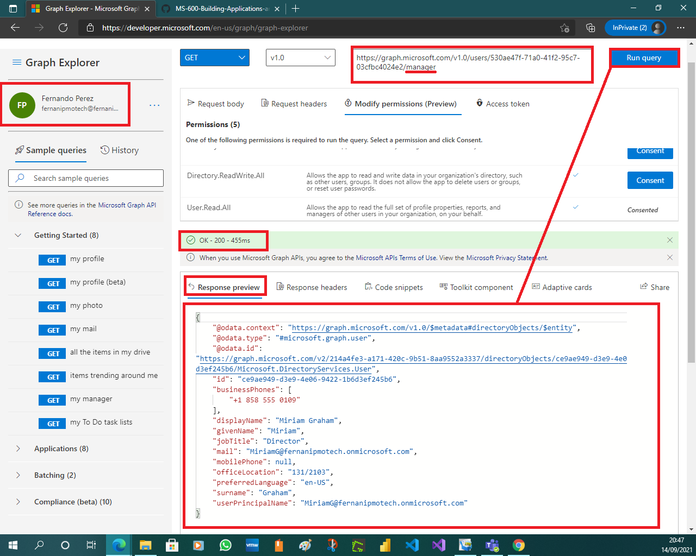

# Exercise 6: Querying user data from Microsoft Graph

This exercise leads the user through a series of tasks utilizing Microsoft Graph Explorer. For this exercise you will use the default sample account and will not sign in.

**Note**:
The trainer should confirm users are not signed on in a browser with a Microsoft 365 account. You may also direct them to open an InPrivate window session.

By the end of this exercise you will be able to:

- Get the signed-in user’s profile.

- Get a list of users in the organization.

- Get the user’s profile photo.

- Get a user object based on the user’s unique identifier.

- Get the user’s manager profile.

  

## Task 1: Go to the Graph Explorer

1. Open the Microsoft Edge browser.

1. Go to this link: [https://developer.microsoft.com/en-us/graph/graph-explorer](https://developer.microsoft.com/en-us/graph/graph-explorer).

   

This page allows users to interact with the Microsoft Graph without needing to write any code. The Microsoft Graph Explorer provides sample data to use for read operations.

**Note**:
Some organizations may not allow users to sign in or consent to specific scopes required for some operations.

## Task 2: Get the signed in user's profile

1. The page loads with a request of **/v1.0/me** entered in the **request URL** box.

1. Select **Run Query**.

   

   

   

   

   

   

   

The data for the current users’ profile is shown in the **Response Preview** pane at the bottom of the page.

## Task 3: Get a list of users in the organization

1. In the request URL box amend the request to be: **/v1.0/users	**

1. Select **Run Query**.

   

   

   

   

   

   

   

This shows a list of users in the organization in the **Response Preview** pane at the bottom of the page.

## Task 4: Get the user object based on the user’s unique identifier

1. In the second item shown in the results, select and copy the **ID** property. This should be the ID for the “**Adele Vance**” user.

   

   

1. In the **request URL** box change the URL to request the profile for a specific user by appending the copied ID to the request URL in the form **/users/{id}**; for example: **/users/87d349ed-44d7-43e1-9a83-5f2406dee5bd**

   

1. Select **Run Query**.

The profile information for that user is shown in the **Response Preview** pane at the bottom of the page.

## Task 5: Get the user's profile photo

1. In the request URL box append **/photo**

1. The URL should now be something like: **https://graph.microsoft.com/v1.0/users/87d349ed-44d7-43e1-9a83-5f2406dee5bd/photo**

   

1. Select **Run Query**. In the **Response Preview,** metadata about the profile picture for the user is shown.

   

1. In the **request URL** box, append **/$value**

1. The URL should now be something like: **https://graph.microsoft.com/v1.0/users/87d349ed-44d7-43e1-9a83-5f2406dee5bd/photo/$value**

   

1. Select **Run Query.** The image for the default profile picture is shown in the **Response Preview** pane at the bottom of the page.

   

## Task 6: Get the user's manager profile

1. In the **request URL** box, replace **/photo/$value** with **/manager**

1. The URL should now be something like: **https://graph.microsoft.com/v1.0/users/87d349ed-44d7-43e1-9a83-5f2406dee5bd/manager**

   

1. Select **Run Query.** The profile information for the manager of the specified user is shown in the **Response Preview** pane.

   

   

   

   

   

   

   

   

   

1. The URL should now be something like: **https://graph.microsoft.com/v1.0/users/87d349ed-44d7-43e1-9a83-5f2406dee5bd/photo**

   

1. Select **Run Query**.

   

## Review

In this exercise, you learned how to:

- Get the signed-in user’s profile.

- Get a list of users in the organization.

- Get the user’s profile photo.

- Get a user object based on the user’s unique identifier.

- Get the user’s manager profile.

