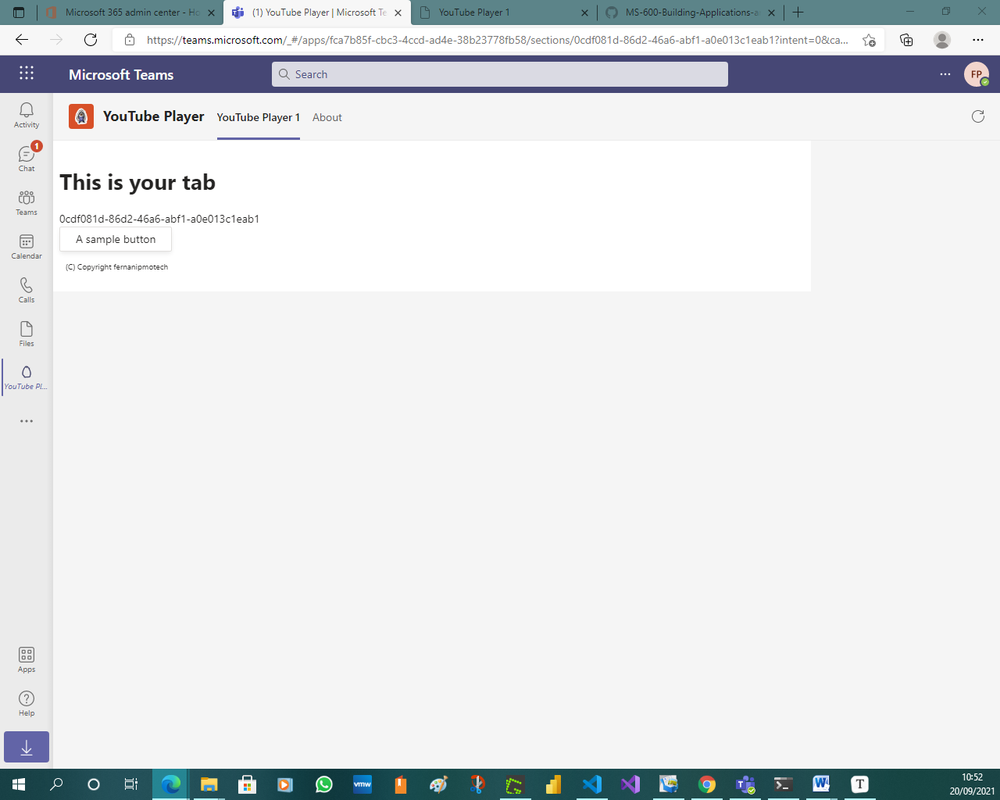
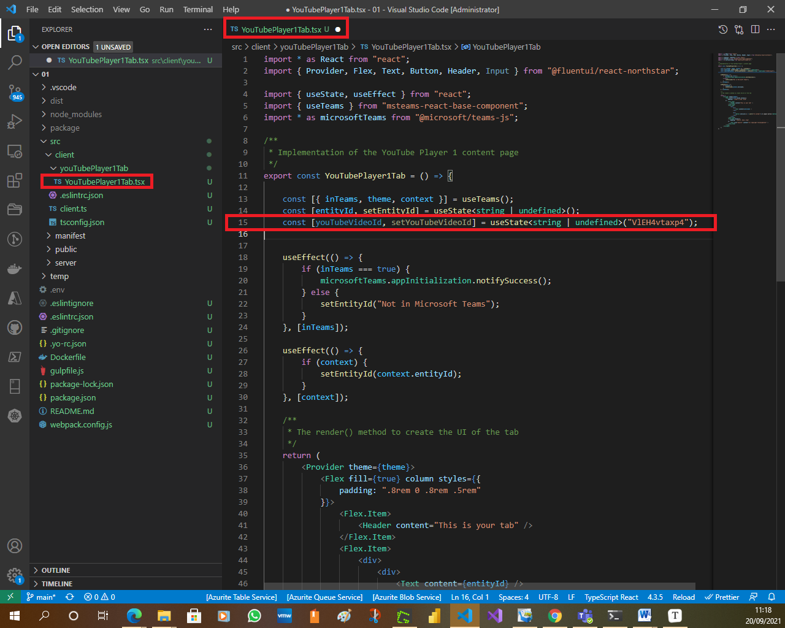
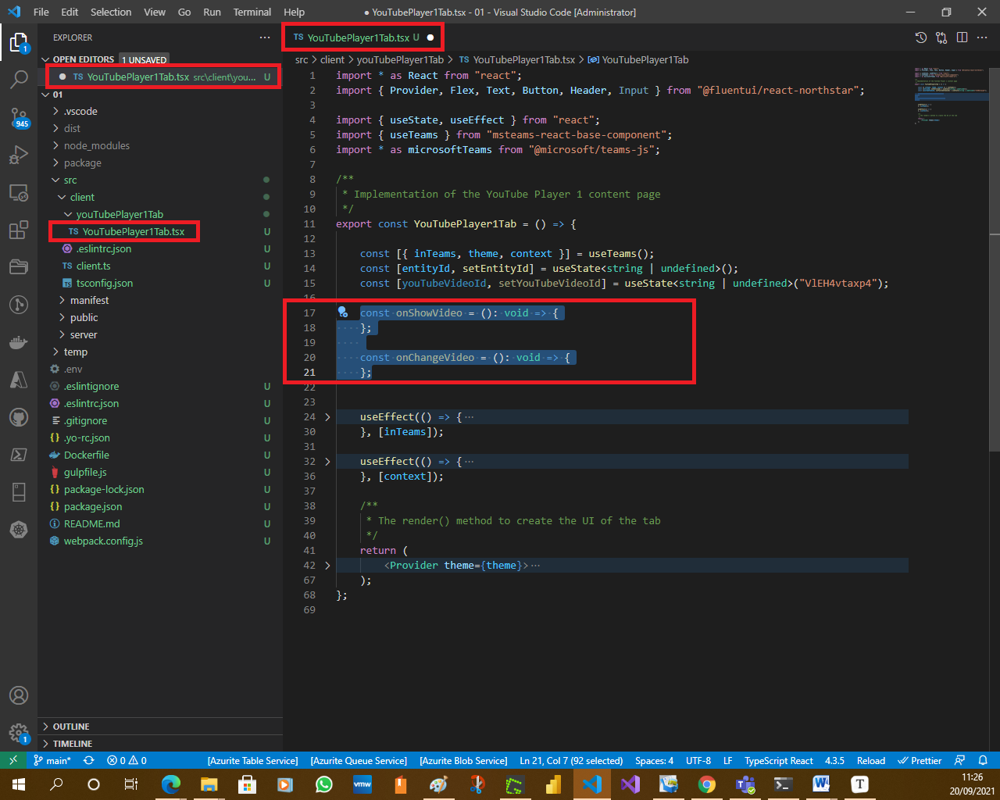
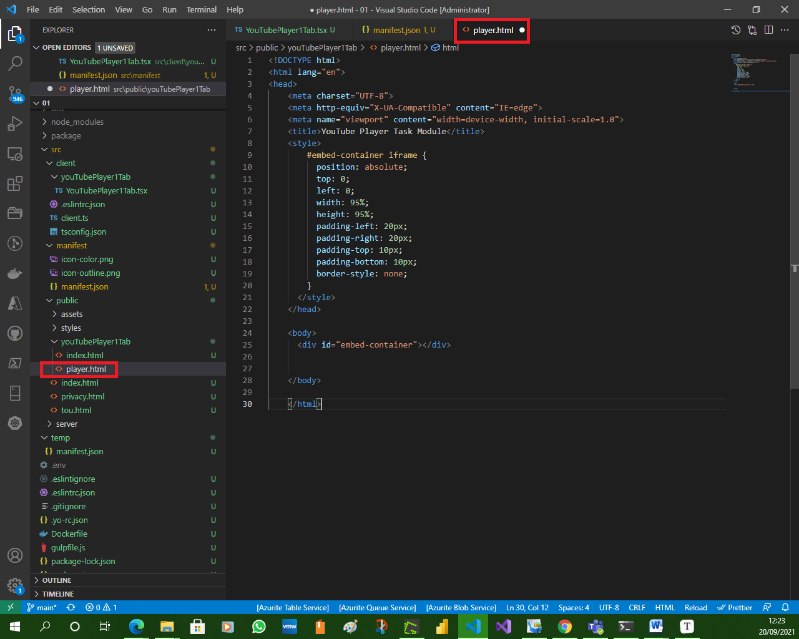
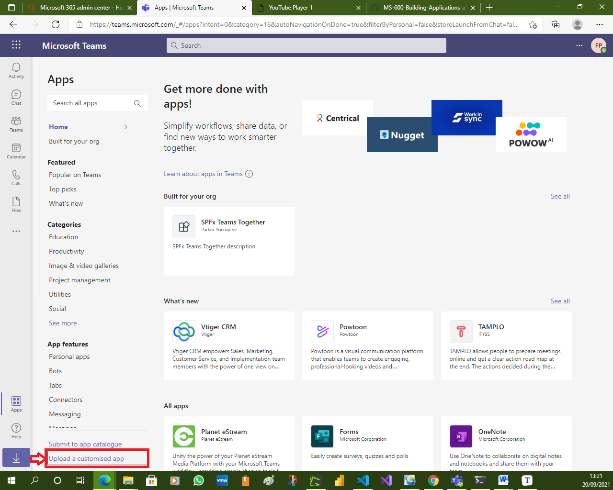
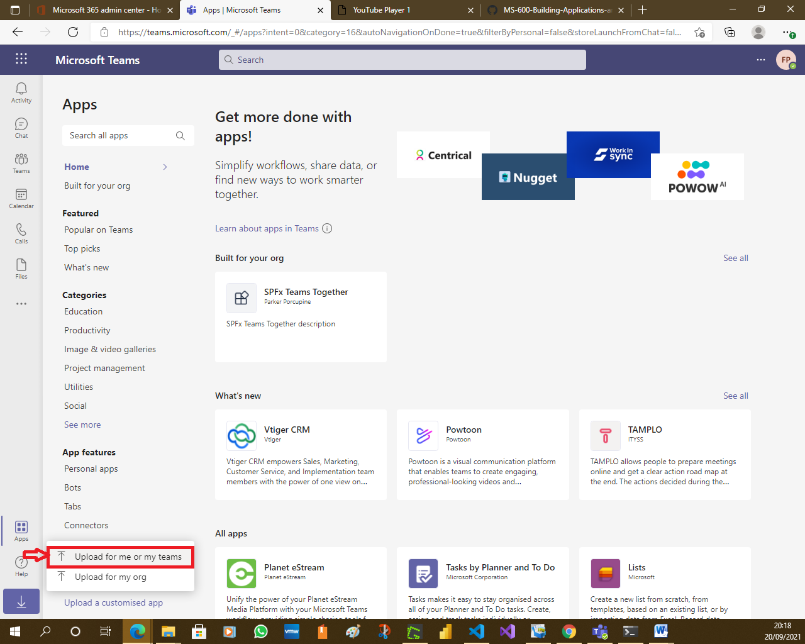
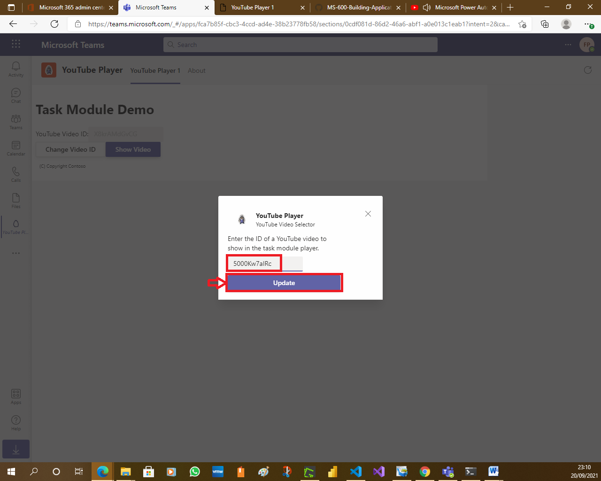
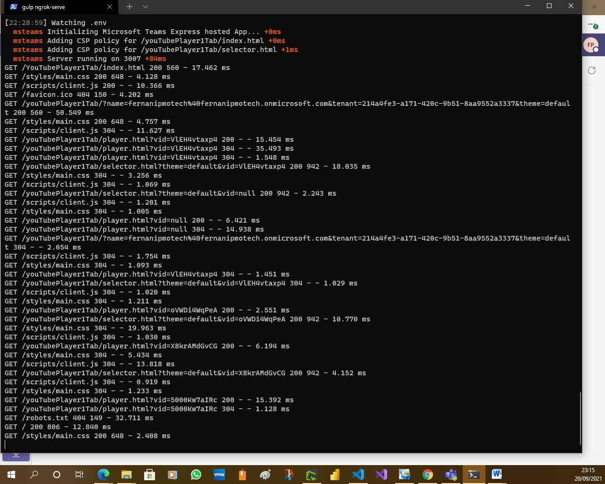

# Exercise 1: Collecting user input with task modules

In this exercise, you'll learn the basics of task modules in Microsoft Teams and how to collect input from users in a custom task module. After creating a new Microsoft Teams personal tab, you'll add two task modules to it.

One is a standard HTML page that accepts the ID of a video on YouTube. When the task module is invoked, it will display the video using the YouTube embedded player. This task module will get the video ID from the query string, but it will not need to return any information back to the tab.

The other task module is implemented using React, the same way custom tabs are implemented using the Yeoman Generator for Microsoft Teams. This task module enables the user to specify the ID of the YouTube video to display. Once changed, when the user saves their changes, it will use the callback to close submit the new ID back to the tab.

## **Previous Tasks**


## Task 1: Create Microsoft Teams app

1. Open your command prompt, navigate to a directory where you want to save your work, create a new folder **learn-msteams-taskmodules**, and change directory into that folder.

1. Run the Yeoman Generator for Microsoft Teams by running the following command:

    ```console
    yo teams
    ```

    

1. Yeoman will launch and ask you a series of questions. Answer the questions with the following values:

    - **What is your solution name?**: YouTubePlayer
    
    - **Where do you want to place the files?**: Use the current folder
    
    - **Title of your Microsoft Teams App project?**: YouTube Player
    
    - **Your (company) name? (max 32 characters)**: Contoso
    
    - **Which manifest version would you like to use?**: v1.8
    
    - **Quick scaffolding**: Yes
    
    - **What features do you want to add to your project?**: A Tab
    
    - **The URL where you will host this solution?**: (Accept the default option)

    - **Would you like to show a loading indicator when your app/tab loads?** No
    
    - **Default Tab name? (max 16 characters)**: YouTube Player 1
    
    - **What kind of Tab would you like to create?**: Personal (static)
    
    - **Do you require Azure AD Single-Sign-On support for the tab?** No
    
      
    
      
    
    > [!NOTE]
    > Most of the answers to these questions can be changed after creating the project. For example, the URL where the project will be hosted isn't important at the time of creating or testing the project.
    
    After answering the generator's questions, the generator will create the scaffolding for the project and then execute `npm install` that downloads all the dependencies required by the project.
    
    

### Test the personal tab

1. Before customizing the tab, let's test the tab to see the initial developer experience for testing.

1. From the command line, navigate to the root folder for the project and execute the following command:

    ```console
    gulp ngrok-serve
    ```

    This gulp task will run many other tasks all displayed within the command-line console. The **ngrok-serve** task builds your project and starts a local web server (http://localhost:3007). It then starts ngrok with a random subdomain that creates a secure URL to your local webserver.

    

    > [!NOTE]
    > Microsoft Teams requires all content displayed within a tab be loaded from an HTTPS request. In development, can be done using the tool [ngrok](https://www.ngrok.com) that creates a secure rotatable URL to your local HTTP webserver. Ngrok is included as a dependency within the project so there is nothing to setup or configure.

    > [!IMPORTANT]
    > Each time ngrok is started, it will generate a new dynamic subdomain for the URL. If you have to restart ngrok, you will need to repackage and and update the app in Microsoft Teams to make the installed app aware of the new URL. The optional licensed version of ngrok allows you to define and reuse the same subdomain.

    

1. Open a browser and navigate to the ngrok URL displayed in the console:

    

1. Update the URL in the browser to load the tab created by the scaffolding process. Here you can see the page can determine that it isn't running within the Microsoft Teams client.

    

    

    

1. Now let's load the tab in Microsoft Teams. In the browser, navigate to **https://teams.microsoft.com** and sign in with the credentials of a Work and School account.

    

    

    > [!NOTE]
    > Microsoft Teams is available for use as a web client, desktop client and a mobile client. In this module, we will use the web client but any of the clients can be used.

1. Using the app bar navigation menu, select the **More added apps** button. Then select **More apps**.

    

1. On the **Browse available apps and services** page, select **Upload a custom app** > **Upload for me or my teams**.

    

    

1. In the file dialog that appears, select the Microsoft Teams package in your project. This app package is a ZIP file that can be found in the project's **./package** folder.

    

1. Once the package is uploaded, Microsoft Teams will display a summary of the app. Here you can see some "todo" items to address. *None of these "todo" items are important to this exercise, so you will leave them as is.*

1. Select the **Add** button to install the app, adding a new personal tab to your **More added apps** dialog:

    

    

1. Select the app to navigate to the new tab:

     

     

     

     Notice that when the content page is loaded in a tab within the Microsoft Teams client, it's displaying the value of the `entityId` property of the tab, not the message "This isn't hosted in Microsoft Teams" as you saw when viewing the content page in the browser. The tab can detect if it's loaded within the Microsoft Teams client using the Microsoft Teams JavaScript SDK.

     The next step is to make some changes to the project.

1. Next, stop the local web server by pressing <kbd>CTRL</kbd>+<kbd>C</kbd> in the console to stop the running process.

     

### Implement the personal tab's user interface

Now you can implement the user interface for the tab. The simple tab will have a basic interface.

1. Locate and open the file that contains the React component used in the project: **./src/client/youTubePlayer1Tab/YouTubePlayer1Tab.tsx**.

    

    

    

    

    

1. Update the `import` statements in this file to add components from the Fluent UI - React library. Find the following `import` statement at the top of the file that imports components from the Fluent UI - React library:

    ```typescript
    import { Provider, Flex, Text, Button, Header } from "@fluentui/react-northstar";
    ```

    

    Replace the previous statement with the following `import` statement:

    ```typescript
    import { Provider, Flex, Text, Button, Header, Input } from "@fluentui/react-northstar";
    ```

    

1. Update the state of the component to contain a video ID. Add the following statement after the existing `useState` statements in the **YouTubePlayer1Tab.tsx** file:

    ```typescript
    const [youTubeVideoId, setYouTubeVideoId] = useState<string | undefined>("VlEH4vtaxp4");
    ```

    

1. Add the following methods to the `YouTubePlayer1Tab` class. These methods will handle updating the state when specific events happen on the form you'll add to the component:

    ```typescript
    const onShowVideo = (): void => {
    };
    
    const onChangeVideo = (): void => {
    };
    ```

    

    

1. Locate the `return` statement and update to the following code. The component will now display state with a brief copyright statement:

    ```tsx
    return (
      <Provider theme={theme}>
        <Flex fill={true} column styles={{
          padding: ".8rem 0 .8rem .5rem"
        }}>
          <Flex.Item>
            <Header>Task Module Demo</Header>
          </Flex.Item>
          <Flex.Item>
            <div>
              <div>
                <Text>YouTube Video ID:</Text>
                <Input value={youTubeVideoId} disabled></Input>
              </div>
              <div>
                <Button content="Change Video ID" onClick={() => onChangeVideo()}></Button>
                <Button content="Show Video" primary onClick={() => onShowVideo()}></Button>
              </div>
            </div>
          </Flex.Item>
          <Flex.Item styles={{
            padding: ".8rem 0 .8rem .5rem"
          }}>
            <Text content="(C) Copyright Contoso" size="smaller"></Text>
          </Flex.Item>
        </Flex>
      </Provider>
    );
    ```


The next step is to add some interactivity to the tab.

### Test the personal tab

At this point, our Microsoft Teams app, implemented as a custom person tab is set up and working. Verify this by starting ngrok again and refreshing the Microsoft Teams interface.

1. Increment the `version` property in the app's **./manifest/manifest.json** file so you can update the previously deployed Teams app.

    

    

    

1. From the command line, navigate to the root folder for the project and execute the following command:

    ```console
    gulp ngrok-serve
    ```

    

    

    

1. Upgrade the previously deployed Teams app with the updated app package.

    

    

    

    

    

    

    

1. In the browser, navigate back to the tab and notice the new UI you've implemented for the tab:

    

    Now you can update the project and add task modules to the custom Microsoft Teams app.

1. Stop the local web server by pressing <kbd>CTRL</kbd>+<kbd>C</kbd> in the console to stop the running process.

    

    

    

## Task 2: Add video player task module

1. A task module can be a web page implemented with HTML and JavaScript. Create the video player task module by creating a new file, **player.html** in the **./src/public/youTubePlayer1Tab** folder in your project.

    

    

    

    

    

    

    

1. Add the following HTML to the **player.html** file:

    ```html
    <!DOCTYPE html>
    <html lang="en">
    
    <head>
      <title>YouTube Player Task Module</title>
      <style>
        #embed-container iframe {
          position: absolute;
          top: 0;
          left: 0;
          width: 95%;
          height: 95%;
          padding-left: 20px;
          padding-right: 20px;
          padding-top: 10px;
          padding-bottom: 10px;
          border-style: none;
        }
      </style>
    </head>
    
    <body>
      <div id="embed-container"></div>
    </body>
    
    </html>
    ```

    

    

    

    The video player task module will use the YouTube embedded player to show the specified video. The video will be defined in the query string when the **player.html** file is loaded.

1. Implement the `<iframe>` embedded video player by adding the following JavaScript before the closing `</body>` tag in the **player.html** file:

    ```html
    <script>
      function getUrlParameter(name) {
        name = name.replace(/[\[]/, '\\[').replace(/[\]]/, '\\]');
        var regex = new RegExp('[\\?&]' + name + '=([^&#]*)');
        var results = regex.exec(location.search);
        return results === null ? '' : decodeURIComponent(results[1].replace(/\+/g, ' '));
      };
    
      var element = document.createElement("iframe");
      element.src = "https://www.youtube.com/embed/" + getUrlParameter("vid");
      element.width = "1000";
      element.height = "700";
      element.frameborder = "0";
      element.allow = "autoplay; encrypted-media";
      element.allowfullscreen = "";
    
      document.getElementById("embed-container").appendChild(element);
    </script>
    ```

    

    

    Now, implement the task module in the personal tab.

1. Locate and open the **./src/client/youTubePlayer1Tab/YouTubePlayer1Tab.tsx** file.

    

1. First, add the following utility method to the `YouTubePlayer1Tab` component:

    ```typescript
    const appRoot = (): string => {
      if (typeof window === "undefined") {
        return "https://{{HOSTNAME}}";
      } else {
        return window.location.protocol + "//" + window.location.host;
      }
    }
    ```

    

    

1. Next, add the following code to the `onShowVideo()` method:

    ```typescript
    const onShowVideo = (): void => {
      const taskModuleInfo = {
        title: "YouTube Player",
        url: appRoot() + `/youTubePlayer1Tab/player.html?vid=${youTubeVideoId}`,
        width: 1000,
        height: 700
      };
      microsoftTeams.tasks.startTask(taskModuleInfo);
    }
    ```

    
    
    This code will create a new `taskInfo` object with the details of the task module. It will then launch the task module. This task module does nothing but display information, so we don't need to implement the callback.

### Test the video player task module

1. Increment the `version` property in the app's **./manifest/manifest.json** file so you can update the previously deployed Teams app.

    

    

    

1. From the command line, navigate to the root folder for the project and execute the following command:

    ```console
    gulp ngrok-serve
    ```

    

    

1. Upgrade the previously deployed Teams app with the updated app package.

    

    

    

    

    

    

    

1. In the browser, navigate back to the tab in the Microsoft Teams interface. Select the **Show video** button. Microsoft Teams will load the video player task module with the specified video loaded in the embedded player:

    

    

    

    

1. Stop the local web server by pressing <kbd>CTRL</kbd>+<kbd>C</kbd> in the console to stop the running process.

    

## Task 3: Add video selector task module

Now let's update the project to include a task module that will enable the user to change the video loaded in the player task module. For this task module, you'll implement it similar to how the custom tab is implemented: as a React app.

### Create the task module's React app web page host

1. Create a new file, **selector.html**, in the **./src/public/youTubePlayer1Tab** folder.

    

    

    

    

    

    

1. Add the following HTML to it:

    ```html
    <!DOCTYPE html>
    <html>
    
    <head>
      <meta charset="UTF-8">
      <title>YouTube Video Selector</title>
      <meta name="viewport" content="width=device-width, initial-scale=1.0">
      <!-- inject:css -->
      <!-- endinject -->
      <style>
        #app {
          margin-left: 20px;
          margin-right: 20px;
          margin-top: 10px;
          margin-bottom: 10px;
        }
      </style>
    </head>
    
    <body>
      <div id='app'>
        Loading...
      </div>
      <!-- inject:js -->
      <!-- endinject -->
      <script type='text/javascript'>
        youTubePlayer.render(youTubePlayer.VideoSelectorTaskModule, document.getElementById('app'), {});
      </script>
    </body>
    
    </html>
    ```


### Register the new page

Next, register the page you created in the last step with the project's hosting infrastructure. This will also add the necessary HTTP headers to the page's response to ensure it can be loaded within an IFRAME, but only within a Microsoft Teams client.

1. Create a new file, **VideoSelectorTaskModule.ts**, in the **./src/server/youTubePlayer1Tab** folder.

    

    

    

1. Add the following code to the file:

    ```typescript
    import { PreventIframe } from "express-msteams-host";
    
    @PreventIframe("/youTubePlayer1Tab/selector.html")
    
    export class VideoSelectorTaskModule { }
    ```

    

1. Now register the page by adding the following line to the end of the **./src/server/TeamsAppComponents.ts** file:

    ```typescript
    export * from "./youTubePlayer1Tab/VideoSelectorTaskModule";
    ```


### Implement the React app for the selector task module

With the selector's page created and registered, the next step is to implement the React app that is loaded in the page.

1. Create a new file, **VideoSelectorTaskModule.tsx**, in the folder **./src/client/youTubePlayer1Tab**.

    

    

1. Add the following code to the page. Most of this code mirrors what you would see if you created a new tab.

    ```typescript
    import * as React from "react";
    import { Provider, Flex, Text, Button, Header, Input } from "@fluentui/react-northstar";
    import { useState, useEffect } from "react";
    import { useTeams, getQueryVariable } from "msteams-react-base-component";
    import * as microsoftTeams from "@microsoft/teams-js";
    ```


    export const VideoSelectorTaskModule = () => {
    
      const [{ inTeams, theme, context }] = useTeams();
      const [entityId, setEntityId] = useState<string | undefined>();
      const [youTubeVideoId, setYouTubeVideoId] = useState<string | undefined>("VlEH4vtaxp4");
    
      useEffect(() => {
        if (inTeams === true) {
          microsoftTeams.appInitialization.notifySuccess();
        } else {
          setEntityId("Not in Microsoft Teams");
        }
      }, [inTeams]);
    
      useEffect(() => {
        if (context) {
          setEntityId(context.entityId);
          setYouTubeVideoId(getQueryVariable("vid"));
        }
      }, [context]);
    
      return (
      );
    };
    ```


1. Implement the user interface of the task module by adding the following code to the `return()` statement:

    ```tsx
    <Provider theme={theme}>
      <Flex column gap="gap.smaller">
        <Text size="medium">
          Enter the ID of a YouTube video to show in the task module player.
        </Text>
        <Input value={youTubeVideoId} onChange={(e) => handleOnChanged(e)}></Input>
        <Button content="Update" primary onClick={() => handleOnClick()}></Button>
      </Flex>
    </Provider>
    ```

    

1. Next, implement the two handlers referenced in the `render()` method. Add these two functions to the `VideoSelectorTaskModule` class:

    ```typescript
    const handleOnChanged = (event): void => {
      setYouTubeVideoId(event.target.value);
    };
    
    const handleOnClick = (): void => {
      microsoftTeams.tasks.submitTask(youTubeVideoId, undefined);
    };
    ```

    

    

    The `handleOnChanged()` method updates the state with the value specified in the input control, while the `handleOnClick()` method uses the Microsoft Teams SDK to pass the ID of the video back to the personal tab.

1. Make this React class available to the rest of the application by adding the following line to the **./src/client/client.ts** file:

    ```typescript
    export * from "./youTubePlayer1Tab/VideoSelectorTaskModule";
    ```

    

1. The last step is to wire this task module up to the tab. Within the **./src/client/youTubePlayer1Tab/YouTubePlayer1Tab.tsx** file, locate the method `onChangeVideo()`. Add the following code to the method:

    ```typescript
    const taskModuleInfo = {
      title: "YouTube Video Selector",
      url: appRoot() + `/youTubePlayer1Tab/selector.html?theme={theme}&vid=${youTubeVideoId}`,
      width: 350,
      height: 150
    };
    
    const submitHandler = (err: string, result: string): void => {
      console.log(`Submit handler - err: ${err}`);
      setYouTubeVideoId(result);
    };
    
    microsoftTeams.tasks.startTask(taskModuleInfo, submitHandler);
    ```

    
    
    
    
    This code will first create the `taskInfo` object that defines the task module. It also creates a callback that will take the result from the task module and use it to update the state of the React app.

### Test the video selector task module

1. Increment the `version` property in the app's **./manifest/manifest.json** file so you can update the previously deployed Teams app.

    

    

    

1. From the command line, navigate to the root folder for the project and execute the following command:

    ```console
    gulp ngrok-serve
    ```

    

    

    

    

    

    

    

    

    

    

    

    

    

    

    

    

    

    

    

    

    

    

    

    

    

1. Upgrade the previously deployed Teams app with the updated app package.

    

    

    

    

    

1. In the browser, navigate back to the tab in the Microsoft Teams interface.

    

    

    

1. Select the **Change Video ID** button. Microsoft Teams will load the video selector task module with the ID of the currently selected video in the text control.

    

    

    

    

    

    

    

    

    

    

    

    

    

1. Enter the ID of another YouTube video and select the **Update** button. Notice the ID of the video has changed. Now when you select the **Show video** button, the player task module loads with the new video.

    

    

    

    

    

    

    

    

    

    

    

    

    

    

    

    

    

    

    

    

    

    

    

    

    

1. Stop the local web server by pressing <kbd>CTRL</kbd>+<kbd>C</kbd> in the console to stop the running process.

    

    

## Summary

In this exercise, you learned the basics of task modules in Microsoft Teams and how to collect input from users in a custom Teams tab. After creating a new Microsoft Teams personal tab, you added two task modules to it.