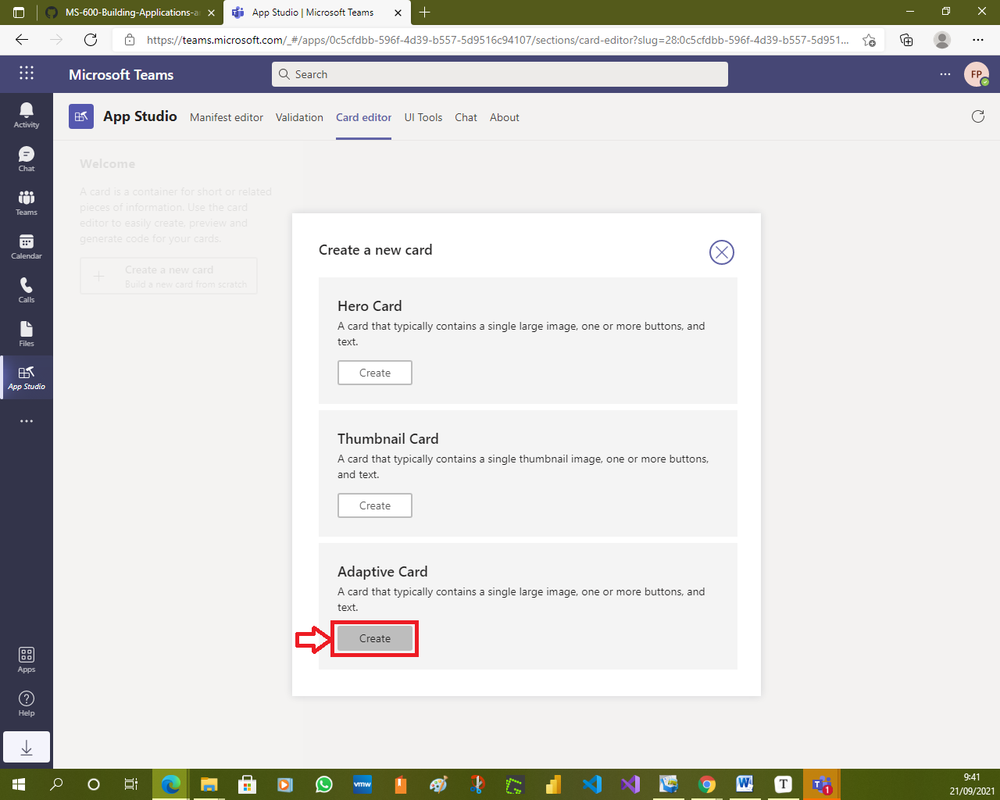
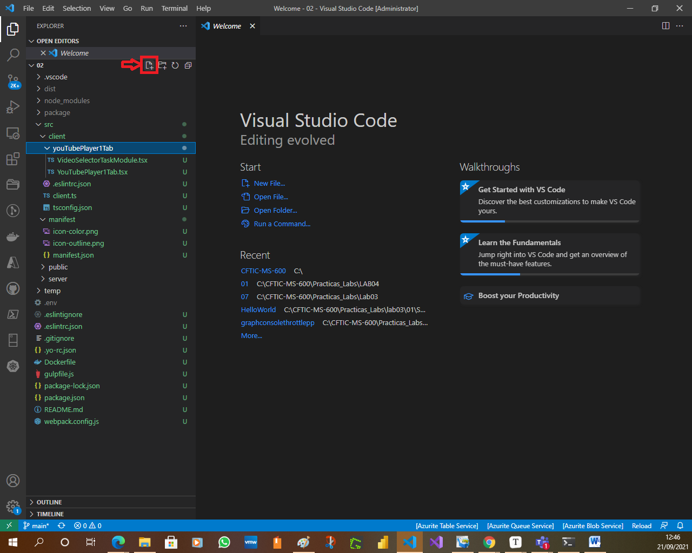
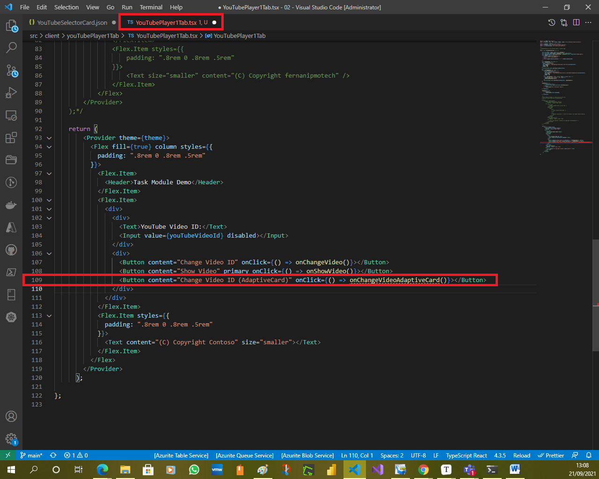

# Exercise 2: Using adaptive cards and deep links in task modules

In this exercise, you'll learn how to use adaptive cards in a custom task module in a custom Microsoft Teams app. You'll also learn how to invoke task modules from anywhere within Microsoft Teams using deep links.

> [!IMPORTANT]
> This exercise assumes you have created the Microsoft Teams app project with the Yeoman generator that contains a personal tab from the previous exercise in this lesson. You'll update the project to add a new task module that uses an Adaptive Card.

## Task 1: Create video selector as an adaptive card

In this section, you'll create an Adaptive Card that mirrors the functionality of the video selector task module created in a previous exercise. Adaptive Cards are defined using JSON that can be written by hand or using the Microsoft Teams App Studio app.

1. In the browser, navigate to **https://teams.microsoft.com** and sign in with the credentials of a Work and School account.

    

    

    

    

1. Select the **More added apps** menu item from the left-hand navigation and select the **App Studio** app:

    

    

    > [!TIP]
    > If App Studio is not listed in the **More added apps** dialog as shown above, select **More apps** at the bottom of the dialog.
    >
    > Search for **App Studio** and select it from the search results to install it:
    >
    > 
    >
    > 
    >
    > 

1. In App Studio, select the **Card editor** tab and then select the **Create a new card** button.

    

1. Select the **Create** button for an **Adaptive Card** in the list of card types you can create in the **Create a new card** dialog.

    

1. The App Studio Card editor will show a default card and its live preview. You can use this interface to design your card and see how it will be rendered.

    

1. From the **json** tab, replace the contents of the default card with the following JSON:

    ```json
    {
    "$schema": "http://adaptivecards.io/schemas/adaptive-card.json",
    "type": "AdaptiveCard",
    "version": "1.0",
    "body": [
        {
        "type": "Container",
        "items": [
            {
            "type": "TextBlock",
            "text": "YouTube Video Selector",
            "weight": "bolder",
            "size": "extraLarge"
            }
        ]
        },
        {
        "type": "Container",
        "items": [
            {
            "type": "TextBlock",
            "text": "Enter the ID of a YouTube video to show in the task module player.",
            "wrap": true
            },
            {
            "type": "Input.Text",
            "id": "youTubeVideoId",
            "value": ""
            }
        ]
        }
    ],
    "actions": [
        {
        "type": "Action.Submit",
        "title": "Update"
        }
    ]
    }
    ```

    

    

    

    

    

    

    

    

    

    This JSON code instructs Microsoft Teams to render a textbox and button. When the button is selected, it will submit the card.

    

    

1. Copy and paste this JSON into a new file, **YouTubeSelectorCard.json**, into the folder in the existing project **./src/client/youTubePlayer1Tab/**.

    

    

    

    

    

    

    

    

    

## Task 2: Create a new task module that uses the Adaptive Card

After creating the Adaptive Card, the next step is to create a task module that will display it and handle the submission action.

1. Within the existing Microsoft Teams app project, locate the file **./src/client/youTubePlayer1Tab/YouTubePlayer1Tab.tsx** that contains the custom personal tab.

    

    

1. Locate the `return` statement and add the following code to add a button after one of the existing buttons:

    ```tsx
    <Button content="Change Video ID (AdaptiveCard)" onClick={() => onChangeVideoAdaptiveCard()}></Button>
    ```

    

    

1. Next, add the following method to the `YouTubePlayer1Tab` class:

    ```typescript
    const onChangeVideoAdaptiveCard = (): void => {
    const taskModuleInfo = {
        title: "YouTube Video Selector",
        width: 350,
        height: 250
    };
    
    const submitHandler = (err: string, result: any): void => {
    };
    
    microsoftTeams.tasks.startTask(taskModuleInfo, submitHandler);
    };
    ```

    

1. The first step is to load the Adaptive Card and set the value of the video ID to display when it loads. Do this by adding the following code to the top of the `onChangeVideoAdaptiveCard()` method:

    ```typescript
    // load adaptive card
    const adaptiveCard: any = require("./YouTubeSelectorCard.json");
    // update card with current video ID
    adaptiveCard.body.forEach((container: any) => {
    if (container.type === "Container") {
        container.items.forEach((item: any) => {
        if (item.id && item.id === "youTubeVideoId") {
            item.value = youTubeVideoId;
        }
        });
    }
    });
    ```

    

1. Next, implement the callback. When the Adaptive Card executes the submit action, it will send an object back with all the input objects as properties. Update the existing `submitHandler()` in the `onChangeVideoAdaptiveCard()` function. This code will update the state with the value of the video ID specified in the Adaptive Card:

    ```typescript
    const submitHandler = (err: string, result: any): void => {
    console.log(`Submit handler - err: ${err}`);
    setYouTubeVideoId(result.youTubeVideoId);
    };
    ```

    

1. Lastly, add a new `card` property to the `taskModuleInfo` object, and set its value to the adaptive card. The resulting `taskModuleInfo` should look like the following code:

    ```typescript
    const taskModuleInfo = {
    title: "YouTube Video Selector",
    card: adaptiveCard,
    width: 350,
    height: 250
    };
    ```


### Test the Adaptive Card task module

1. Increment the `version` property in the app's **./manifest/manifest.json** file so you can update the previously deployed Teams app.

    

    

    

    

1. From the command line, navigate to the root folder for the project and execute the following command:

    ```console
    gulp ngrok-serve
    ```

    

    

    

1. Upgrade the previously deployed Teams app with the updated app package.

    

    

    

    

    

    

1. In the browser, navigate back to the tab in the Microsoft Teams interface and select the new button **Change Video ID (AdaptiveCard)**. Microsoft Teams will open a task module with the rendered Adaptive Card:

    

    

    

    

    

1. Replace the video ID in the input box and select **Update**. Notice the video ID displayed in the tab is updated to reflect this new value.

    

    

    

    

    

## Task 3: Invoking task modules with deep links

Task modules can be invoked by selecting a button in the Microsoft Teams experience, or using a deep link. Deep links allow you to trigger a task module invocation from outside of Teams, or within Teams from a conversation.

The format for a deep link is as follows:

```http
https://teams.microsoft.com/l/task/<APP_ID>?url=<TaskInfo.url>&height=<TaskInfo.height>&width=<TaskInfo.width>&title=<TaskInfo.title>
```

Consider if you wanted to open a task module from a conversation that would display the following video on an **[Overview of teams and channels](https://www.youtube.com/watch?v=VlEH4vtaxp4)**.

As you learned in a previous exercise, the URL to display the video in the player task module would be the following:

```http
https://{{REPLACE_WITH_YOUR_NGROK_URL}}/youTubePlayer1Tab/player.html?vid=VlEH4vtaxp4
```

The deep link for to launch the video player task module would be the following (*assuming your custom Microsoft Teams app's ID is 3386faf0-109f-11ea-9799-77a28170bd5d*):

```http
https://teams.microsoft.com/l/task/3386faf0-109f-11ea-9799-77a28170bd5d?url=https://{{REPLACE_WITH_YOUR_NGROK_URL}}/youTubePlayer1Tab/player.html?vid=VlEH4vtaxp4&height=700&width=1000&title=YouTube%20Player:%20Overview%20of%20teams%20and%20channels
```


1. In Microsoft Teams, go to a channel, select the **Conversations** tab, and select the **Format** button in the message dialog:

    

    

1. Enter a message to post to the channel. Select some of the text and use the **Link** feature to add the deep link to the message:

    

    

1. Now, select the link to see the task module open without having to trigger it from the custom tab.

    

    

    

    

    

    

    

    

    

    

    

    

    

    

    

    

    

    

    

    

    

    

    

    

    

    

    

    

    

    

    

## Summary

In this exercise, you learned how to use adaptive cards in a custom task module in a custom Microsoft Teams app. You also learned how to invoke task modules from anywhere within Microsoft Teams using deep links.